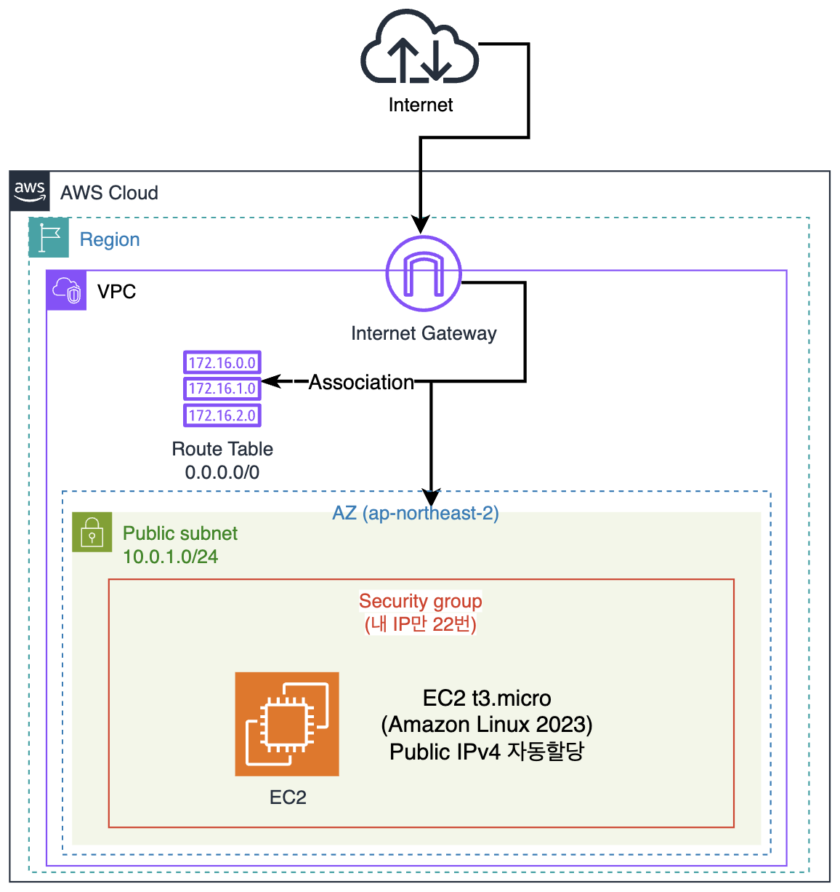

# Week 2 · 개념 워크북: 참조 한 줄이 순서를 만듭니다

> [!NOTE]
> 이 문서는 개념 파트(12분)입니다. 손으로 직접 치는 실습은 같은 `lecture/` 폴더의 `실습워크북`을 따라가시면 됩니다. `[개념]`은 설명이고, `[함정]`은 미리 피해야 할 것입니다.
>
> 이 문서를 덮을 때 아래 두 가지가 되면 성공입니다.
> ① 내가 순서를 적지 않았는데 순서가 지켜지는 이유를 그림 하나로 설명할 수 있다.
> ② `terraform.tfstate` 파일을 열었을 때 어느 칸이 무엇인지 손가락으로 짚을 수 있다.

> [!IMPORTANT]
> 처음 보는 AWS 단어가 많이 나옵니다. 겁먹지 마세요.
> VPC, 서브넷, 라우트 테이블 같은 말을 오늘 처음 듣는 분들이 대부분입니다. 그래서 이 문서는 0번 섹션에서 그 단어들부터 하나씩 풀고 시작합니다. 0번만 읽어도 오늘 실습은 따라올 수 있습니다.
>
> 그리고 오늘 설명하려는 건 AWS 서비스 사용법보다는 **"코드에 순서를 안 적었는데 왜 순서대로 만들어지는가"** 쪽입니다. AWS 리소스들은 그걸 보여주려고 가져온 소재입니다.

> [!NOTE]
> Week 1을 다시 설명하지는 않습니다. IaC가 뭔지, 선언형이 뭔지, provider가 뭔지, `init`/`plan`/`apply`/`destroy`가 뭔지, state가 왜 필요한지는 Week1 개념워크북 2·3·4·8·11번에 있습니다. 기억이 흐릿하면 그것부터 5분만 훑고 오세요.
>
> 대신 오늘은 Week1에서 "이건 다음에 설명할게요" 하고 넘어갔던 세 가지를 회수합니다.
>
> | Week1에서 | 그때 한 말 | 오늘 |
> |----------|-----------|------|
> | 7번 TIP | "`bucket = aws_s3_bucket.lab.id` 한 줄이 순서를 만듭니다. 이걸 암묵적 의존성이라고 하고 Week2 주제입니다" | **4번** |
> | 7번 NOTE | "`~` 대신 `-/+`가 뜰 때가 있습니다. 언제 그런지는 뒤 주차에서" | **12번** |
> | `[함정]` 콘솔 수정 | "콘솔에서 손으로 고치면 다음 apply에서 사라집니다" | **11번** |

---

## 오늘 다룰 것

> [!NOTE]
> 섹션이 여러 개지만 라이브에서 짚는 건 다섯 군데뿐입니다(합쳐서 12분). 나머지는 실습하다 막혔을 때 돌아와서 찾아 읽는 용도입니다.
>
> | 언제 | 무엇을 |
> |------|-------|
> | **실습 시작 전에 통으로** | **Part 0** (0-1 ~ 0-5, 6분). AWS 단어를 모르면 실습이 타이핑 연습이 됩니다 |
> | A-5 `plan` 대기 중 | 1번(참조 11개) · 4번(그래프). 3분 |
> | A-6 `apply` 대기 중 | 7번(데이터 소스). 1분 |
> | B-3 `apply` 대기 중 | 9번(tfstate). 2분 |
>
> Part 0만 미리 떼어놓고, 나머지는 `plan`과 `apply`가 도는 대기 시간에 얹습니다.

진행 순서는 이렇습니다.

```
  0. AWS 리소스 익히기  ->  1~3. 참조란 무엇인가  ->  4~6. 참조가 그래프가 된다
                                                         |
                       9~12. 그 결과가 state에 적힌다  <- 7~8. data로 값을 물어본다
```

---

# Part 0. 먼저 AWS 리소스부터: 오늘 쓰는 단어 익히기

### [개념] 0-1. 오늘 짓는 것을 한 문장으로

오늘 짓는 건 인터넷에서 접근할 수 있는 리눅스 서버 한 대입니다. 목표만 보면 아주 단순하죠.

그런데 AWS에서는 서버 한 대를 띄우려고 서버만 만들어서는 안 됩니다. 서버가 놓일 자리와 나갈 길과 문지기를 먼저 만들어야 합니다. 그래서 리소스가 7개가 됩니다.



바깥에서 안으로 읽으면 됩니다. 리전 안에 VPC가 있고, VPC는 그 리전의 가용영역들에 걸쳐 있으며, 서브넷은 그중 가용영역 하나에 속합니다. 인터넷 게이트웨이와 라우트 테이블은 특정 가용영역이 아니라 VPC에 속합니다.

Week1 1번에서 3계층 그림을 보며 "이 5개는 오늘 만들지 않습니다"라고 했었죠. 그중 네트워크와 VM을 오늘 진짜로 만듭니다.

---

### [개념] 0-2. 리소스 사전: 아파트 단지에 비유하면

아래 표를 오늘 하루 옆에 펴두고 보세요. 모르는 단어가 나오면 여기로 돌아오면 됩니다.

| 리소스 | Terraform 타입 | 비유 | 실제로 하는 일 |
|------|---------------|------|--------------|
| **VPC** | `aws_vpc` | 내가 분양받은 부지 전체 | AWS 안에 나만 쓰는 사설 네트워크 공간을 만듭니다 |
| **서브넷** | `aws_subnet` | 부지 안의 한 구역 | VPC를 더 작게 쪼갠 주소 구역. 서버는 반드시 어느 한 구역 안에 놓입니다 |
| **인터넷 게이트웨이(IGW)** | `aws_internet_gateway` | 단지 정문 | 이게 없으면 VPC 안의 모든 것은 바깥과 완전히 단절됩니다 |
| **라우트 테이블** | `aws_route_table` | 이정표 | "이 주소로 갈 거면 저 문으로 나가세요"를 적어둔 판. 정문을 달아둬도 이정표에 적히지 않으면 아무도 그 문을 쓰지 않습니다 |
| **연결(association)** | `aws_route_table_association` | "이 구역은 저 이정표를 따른다"는 게시 | 이정표를 만들어 둬도 구역에 붙이지 않으면 아무 효과가 없습니다 |
| **시큐리티 그룹(SG)** | `aws_security_group` | 건물 현관 경비원 | 서버 앞에 붙는 방화벽. "누가 몇 번 문으로 들어올 수 있는가"를 정합니다 |
| **EC2 인스턴스** | `aws_instance` | 건물(서버) 본체 | 실제로 켜지는 가상 서버 한 대 |

여기에 직접 만들지는 않지만 값을 물어봐야 하는 것이 둘 더 있습니다.

| 리소스 | Terraform | 비유 | 실제로 하는 일 |
|------|-----------|------|--------------|
| **AMI** | `data "aws_ami"` | 입주할 때 트럭으로 실어 넣는 초기 짐 한 세트 | 서버를 켤 때 디스크에 복사해 넣는 OS 이미지 |
| **가용영역(AZ)** | `data "aws_availability_zones"` | 구역 하나가 속하는 동네. 부지는 여러 동네에 걸쳐 있습니다 | 서울 리전 안에 물리적으로 떨어진 데이터센터 그룹들 |

> [!NOTE]
> **용어 · 리전(region)과 가용영역(AZ):** 리전은 "서울"처럼 지리적으로 큰 단위입니다(`ap-northeast-2`). 그 안에 물리적으로 멀리 떨어뜨려 지은 데이터센터 묶음이 여러 개 있고 이걸 AZ라고 부릅니다(`ap-northeast-2a`, `2b`, `2c`, `2d`). 한 AZ에 정전이나 화재가 나도 다른 AZ는 멀쩡하도록 일부러 떨어뜨려 놓은 것입니다.
>
> 비유로 맞춰보면 이렇습니다. 내 부지(VPC)는 서울 전체에 걸쳐 있고, 그 안에서 잘라낸 구역(서브넷) 하나는 반드시 한 동네 안에 있어야 합니다. "강남 구역", "마포 구역"처럼요. 그래서 서브넷을 만들 때는 "이 구역은 어느 동네냐"를 반드시 정해줘야 하고, 그게 `availability_zone` 인자입니다.
>
> 주의할 점이 하나 있습니다. `2a`라는 이름은 계정마다 다른 동네에 붙습니다. 제 `2a`와 옆 사람의 `2a`가 같은 건물이라는 보장이 없습니다. 그래서 이름을 코드에 박지 않고 AWS에 물어봅니다(참조 ②).

---

### [개념] 0-3. CIDR 읽는 법: `10.0.0.0/16`이 무슨 뜻인가

`10.0.0.0/16` 같은 표기를 CIDR이라고 부릅니다. 처음 보면 암호 같지만 규칙은 하나뿐입니다. 슬래시 뒤 숫자는 "앞에서부터 몇 칸이 고정인가"이고, 숫자가 클수록 좁은 범위입니다.

> [!NOTE]
> **용어 · CIDR (Classless Inter-Domain Routing):** IP 주소 범위를 적는 방법. `주소/숫자` 형태로 쓰고, 뒤 숫자는 앞에서부터 고정되는 비트 수입니다. IPv4 주소는 총 32비트(= 8비트짜리 칸 4개)입니다.

칸 4개짜리 주소에서 앞 몇 칸이 고정인가로 읽으면 편합니다.

| 표기 | 고정되는 부분 | 자유로운 부분 | 주소 개수 | 뜻 |
|------|-------------|--------------|----------|-----|
| `10.0.0.0/16` | `10.0.` (앞 2칸) | 뒤 2칸 | 65,536개 | **10.0.무엇.무엇** 전부 |
| `10.0.1.0/24` | `10.0.1.` (앞 3칸) | 뒤 1칸 | 256개 | **10.0.1.무엇** 전부 |
| `1.2.3.4/32` | 4칸 전부 | 없음 | 1개 | 딱 그 주소 하나 |
| `0.0.0.0/0` | 아무것도 | 전부 | 전부 | 모든 주소(= 인터넷 전체) |

오늘 코드에 나오는 숫자들을 이 규칙으로 읽어보면 이렇습니다. VPC에 적은 `10.0.0.0/16`은 VPC 전체가 쓸 주소 범위입니다. 주소를 6만 5천 개 확보해 둔 셈인데, 나중을 생각해 넉넉하게 잡는 값입니다. 서브넷의 `10.0.1.0/24`는 그중 한 서브넷이 쓸 범위이고 주소 256개짜리이며, VPC 범위 안에 들어가야 합니다. SG에 적는 `1.2.3.4/32`는 딱 내 컴퓨터 한 대를 가리켜서 "이 주소에서 오는 것만 허용"이라는 뜻이 되고, 라우트의 `0.0.0.0/0`은 반대로 "어디로 가든 다 이 문으로"라는 뜻입니다.

> [!TIP]
> `/32`가 왜 "한 개"인지 헷갈리면 이렇게 외우세요. 32칸이 전부 고정 = 바꿀 수 있는 자리가 없음 = 주소 딱 하나. 반대로 `/0`은 고정된 게 하나도 없음 = 아무 주소나 = 전부.

> [!NOTE]
> (참고) 서브넷 하나에서 실제로 서버에 붙일 수 있는 주소는 256개가 아니라 251개입니다. AWS가 각 서브넷의 처음 4개와 마지막 1개를 내부용으로 가져갑니다. 오늘은 서버 한 대만 띄우니 신경 쓸 일은 없습니다.

그리고 하나만 더 짚고 갑니다. 같은 `0.0.0.0/0`인데 어디에 적느냐에 따라 가리키는 대상이 다릅니다.

| 적는 곳 | `0.0.0.0/0`의 뜻 |
|--------|----------------|
| 라우트 테이블 | **목적지**가 어디든. 내 VPC 밖 어디로 나가든 이 문으로 |
| 시큐리티 그룹 | **상대 주소**가 어디든. 누가 오든, 또는 어디로 나가든 |

그래서 라우트의 `0.0.0.0/0`은 필수이고 안전하지만, SG `ingress`의 `0.0.0.0/0`은 위험합니다. 오늘 코드가 `ingress`에는 `내IP/32`만 쓰고 `egress`에만 `0.0.0.0/0`을 쓰는 이유가 이것입니다.

---

### [개념] 0-4. 서버 한 대에 더 필요한 것

리소스 표에는 안 들어가지만 오늘 코드에 값으로 등장하는 것들입니다. 실습에서 손으로 치거나 눈으로 확인하게 되니 여기서 한 번 풀고 갑니다.

> [!NOTE]
> **용어 · 인스턴스 타입:** `t3.micro` 같은 이름은 서버의 사양 등급입니다. 앞부분 `t3`가 세대와 성격(범용, 평소엔 절약하다 필요할 때 잠깐 빨라지는 유형), 뒷부분 `micro`가 크기(vCPU 2개 / 메모리 1GiB)를 뜻합니다. 타입이 정해지면 시간당 요금도 같이 정해집니다.
>
> 렌터카의 차종 등급과 같습니다. "경차 / 준중형 / SUV"처럼 앞이 종류, 뒤가 크기이고, 등급이 곧 시간당 대여료입니다. 그리고 차종(인스턴스 타입)과 트렁크에 실은 짐(AMI)은 별개입니다. 같은 경차에 다른 짐을 실을 수 있고, 같은 짐을 SUV로 옮겨 실을 수도 있습니다.
>
> 오늘은 프리티어 대상인 `t3.micro`만 씁니다. `variables.tf`가 다른 타입을 아예 막고 있어서, 실수로 큰 걸 띄워 과금되는 일은 코드 단계에서 차단됩니다.

> [!NOTE]
> **용어 · 사설 IP와 퍼블릭 IP:** 서버는 주소를 두 개 갖습니다. 사설 IP(`10.0.1.x`)는 내 VPC 안에서만 통하는 주소이고, 퍼블릭 IP(`3.35.x.x`)는 인터넷 어디서든 이 서버를 찾아올 수 있는 주소입니다. 사내 내선번호와 외부 전화번호의 관계와 같습니다. 둘 다 같은 전화기에 붙어 있습니다.
>
> 그리고 실습에서 `curl -4 ifconfig.me`로 확인하는 "내 공인 IP"는 지금 여러분 노트북이 인터넷에서 보이는 주소입니다. 이걸 시큐리티 그룹에 적으면 "이 노트북에서 오는 것만 들여보내라"가 됩니다. 카페 와이파이로 옮기면 이 값이 바뀝니다.

> [!NOTE]
> **용어 · 포트(port):** 서버 하나에 IP 주소는 하나인데 서비스는 여럿 돌 수 있습니다. 그래서 "몇 번 창구로 가는 요청인가"를 번호로 구분하는데, 이 번호가 포트입니다. 웹은 보통 80·443번, 원격 접속(SSH)은 22번을 씁니다.
>
> 한 건물의 여러 창구를 생각하면 됩니다. 주소(IP)는 건물 주소 하나지만 "3번 창구", "22번 창구"처럼 용도별 창구 번호가 따로 있습니다. 경비원(SG)은 "어느 창구에, 어느 주소에서 온 사람을" 들여보낼지를 정합니다.
>
> 실습에서 SG에 적는 `from_port = 22 / to_port = 22`는 22번 창구 하나만 열겠다는 뜻입니다. `from`과 `to`는 범위라서 `80~443`처럼 여러 개를 한 번에 열 수도 있습니다.

> [!NOTE]
> **용어 · EBS와 루트 볼륨:** EC2에 붙이는 디스크입니다. 그중 OS가 깔려 있어서 서버가 부팅하는 디스크를 루트 볼륨이라고 부릅니다. 오늘은 8GiB짜리 `gp3`(요즘 표준인 SSD 종류)를 붙이고, `delete_on_termination = true`로 서버를 지울 때 디스크도 같이 지워지게 해뒀습니다. 이게 없으면 서버를 지워도 디스크만 남아 계속 과금됩니다. 실습 C-4의 "EBS 볼륨 0개" 점검이 그것을 확인하는 단계입니다.

---

### [개념] 0-5. "퍼블릭 서브넷"은 사실 옵션 이름이 아닙니다

AWS 문서를 보면 "퍼블릭 서브넷"이라는 말이 자주 나옵니다. 그런데 `public = true` 같은 체크박스는 존재하지 않습니다. 퍼블릭 서브넷이란 아래 조건을 갖춘 서브넷을 부르는 별명일 뿐입니다.

```
① 주소가 있는가        : 서버에 퍼블릭 IP가 붙었는가
                        -> 서브넷의 map_public_ip_on_launch = true

② 나가는 길이 있는가   : 인터넷으로 가는 라우트가 이 서브넷에 붙었는가
                        -> IGW + 라우트 테이블(0.0.0.0/0 -> IGW) + association

③ 문지기가 허용하는가  : 방화벽이 그 통신을 막고 있지 않은가
                        -> 시큐리티 그룹의 ingress / egress 규칙
```

이 셋 중 하나만 빠져도 에러가 나지 않고 그냥 조용히 안 됩니다. 초보자가 AWS 네트워크에서 가장 많이 헤매는 지점이 정확히 여기입니다. 그래서 오늘 실습은 이 셋을 각각 다른 스텝에서 만듭니다(A-3 / A-4 / B-1). 어디가 빠졌는지 스스로 짚을 수 있게 하려는 것입니다.

③에 나온 `ingress`와 `egress`는 실습 내내 쓰는 말이니 여기서 풀고 갑니다.

> [!NOTE]
> **용어 · ingress와 egress:** 시큐리티 그룹은 양방향 방화벽이고, 규칙을 두 갈래로 적습니다. `ingress`(인그레스)는 **들어오는** 트래픽, `egress`(이그레스)는 **나가는** 트래픽 규칙입니다. 오늘 코드는 "내 IP에서 오는 22번만 들여보내고, 나가는 건 다 허용"으로 씁니다.
>
> 그리고 시큐리티 그룹에는 "차단"을 적을 수 없습니다. 적을 수 있는 건 허용뿐이고, 목록에 없으면 자동으로 막힙니다. 방문객 명단을 든 경비원과 같습니다. "이 사람만 들여보낸다"만 적으면 되고, 나머지는 따로 적지 않아도 못 들어옵니다.
>
> 한 가지 편의도 있습니다. 들여보낸 요청에 대한 응답은 규칙을 따로 안 적어도 나갈 수 있고, 내보낸 요청의 응답도 그냥 돌아옵니다. 그래서 서버가 인터넷에서 패키지를 받아올 수 있는 건 `egress`를 열어둔 덕분이고, 그 응답이 돌아오는 것은 `ingress`를 열지 않아도 됩니다.

> [!NOTE]
> (참고) 콘솔에서 라우트 테이블을 열어보면 우리가 안 적은 줄이 하나 더 있습니다. `10.0.0.0/16 -> local`입니다. VPC 안끼리의 통신 규칙이고 AWS가 자동으로 넣습니다. 지울 수도 없습니다. 우리가 적는 건 "그 외 전부(`0.0.0.0/0`)는 정문으로" 한 줄뿐입니다.

> [!IMPORTANT]
> 오늘은 EC2에 SSH로 접속하지 않습니다. 접속용 키페어를 만들지 않기 때문에 접속할 수도 없습니다. 키를 코드로 만들면 비밀키가 tfstate에 평문으로 저장되고(9번), `.pem` 파일이 실수로 커밋되는 사고가 납니다.
>
> 오늘의 성공 기준은 접속이 아닙니다. `instance_state = running` + 퍼블릭 IP가 붙었다, 여기까지입니다.

---

# Part 1. 참조: 코드 한 줄이 간선 하나

### [개념] 1. 오늘의 그림: 리소스 7개, 참조 11개

0번에서 본 리소스가 7개입니다. VPC 1 + 서브넷 1 + IGW 1 + 라우트 테이블 1 + 연결 1 + 시큐리티 그룹 1 + EC2 1.

그런데 오늘 배울 것은 이 7개보다 7개를 서로 잇는 참조 11개 쪽입니다.

> [!NOTE]
> **용어 · 참조(reference):** 코드에서 다른 리소스의 값을 가리키는 것. `vpc_id = aws_vpc.main.id`처럼 "저기 있는 그 VPC의 ID를 여기에 넣어줘"라고 적는 것입니다. 값을 손으로 베껴 적는 대신 가리킨다는 게 핵심입니다.

이 표가 오늘 문서 전체의 좌표계입니다. 지금 다 외우려 하지 마세요. 실습하면서 "지금 몇 번 참조를 잇는 중이지?" 할 때 돌아와서 보면 됩니다.

| # | 참조를 쓰는 곳 | 가리키는 대상 | 왜 필요한가 |
|---|---------------|--------------|------------|
| ① | `aws_subnet.public` 의 `vpc_id` | `aws_vpc.main` | 서브넷은 VPC 안에만 존재할 수 있으니까 |
| ② | `aws_subnet.public` 의 `availability_zone` | `data.aws_availability_zones.available` | 쓸 수 있는 AZ가 뭔지 AWS에 물어봐야 하니까 |
| ③ | `aws_internet_gateway.gw` 의 `vpc_id` | `aws_vpc.main` | IGW는 어느 VPC에 붙는지 정해져야 하니까 |
| ④ | `aws_route_table.public` 의 `vpc_id` | `aws_vpc.main` | 라우트 테이블도 VPC 소속 |
| ⑤ | `aws_route_table.public` 의 `route.gateway_id` | `aws_internet_gateway.gw` | `0.0.0.0/0`의 출구가 이 IGW라고 적어야 하니까 |
| ⑥ | `aws_route_table_association.public` 의 `subnet_id` | `aws_subnet.public` | 어느 구역에 붙일지 |
| ⑦ | `aws_route_table_association.public` 의 `route_table_id` | `aws_route_table.public` | 어느 라우트 테이블을 붙일지 |
| ⑧ | `aws_security_group.web` 의 `vpc_id` | `aws_vpc.main` | 시큐리티 그룹도 VPC 소속 |
| ⑨ | `aws_instance.web` 의 `subnet_id` | `aws_subnet.public` | 서버가 어느 구역에 놓일지 |
| ⑩ | `aws_instance.web` 의 `vpc_security_group_ids` | `aws_security_group.web` | 리스트라서 `[ ]`로 감쌉니다 |
| ⑪ | `aws_instance.web` 의 `ami` | `data.aws_ami.al2023` | 오늘 유일하게 `data.`로 시작하는 참조 |

이 11개가 곧 그래프의 참조 11개입니다. 4번에서 이 표를 그래프로 세워볼 겁니다.

---

### [개념] 2. 리소스 주소와 참조 문법: 세 조각으로 읽기

Week1 A-5에서 `aws_s3_bucket.lab`이 리소스 주소라는 걸 배웠습니다. 오늘은 여기에 한 칸이 더 붙습니다.

```
aws_subnet.public.id                data.aws_ami.al2023.id
|          |      |                 |    |          |      |
|          |      +- 속성           |    |          |      +- 속성
|          +--------- 이름          |    |          +--------- 이름
+-------------------- 타입          |    +-------------------- 타입
                                    +------------------------- data 접두사
```

주소는 두 조각(`aws_subnet.public`), 참조는 세 조각(`aws_subnet.public.id`)입니다. 주소는 "누구", 참조는 "누구의 무엇"이라고 생각하면 됩니다.

여기서 처음 배우는 분들이 가장 많이 헷갈리는 게 이름이 세 층에 있다는 점입니다.

| 층 | 예 | 누가 정하나 | AWS에 올라가나 |
|----|-----|-----------|--------------|
| 코드 안 이름 | `main`, `public`, `web` | 내가 아무렇게나 | 아니오 |
| 리소스 주소 | `aws_subnet.public` | 타입 + 이름 조합 | 아니오 (state·plan·graph에만 나옵니다) |
| AWS 실제 ID | `subnet-0a1b2c3d4e5f` | AWS가 apply할 때 | 예. `.id`로 받아오는 게 이것 |

읽는 규칙은 딱 하나만 기억하면 됩니다. 등호 왼쪽은 인자 이름(provider가 정해둔 것), 오른쪽은 참조(내가 쓰는 것).

```hcl
vpc_id = aws_vpc.main.id
#  ^          ^
#  |          +-- 오른쪽: 내가 붙인 주소 + 속성
#  +------------- 왼쪽: aws_subnet 이 요구하는 인자 이름 (내 마음대로 못 바꿈)
```

세부 문법은 셋만 짚고 넘어갑니다.

첫째, 대괄호가 붙는 경우입니다.

```hcl
vpc_security_group_ids = [aws_security_group.web.id]
```

인자 이름이 `_ids`로 끝나죠. 여러 개를 받는 자리(리스트)라는 뜻입니다. 시큐리티 그룹은 서버 한 대에 여러 개 붙일 수 있어서 그렇습니다. 하나만 붙여도 `[ ]`가 필요합니다.

둘째, `${}`는 문자열에 섞을 때만 씁니다.

```hcl
tags   = { Name = "${var.project_name}-vpc" }   # 문자열 안에 섞음 -> ${} 필요
vpc_id = aws_vpc.main.id                        # 값 하나를 그대로 씀 -> ${} 불필요
```

`vpc_id = "${aws_vpc.main.id}"`라고 써도 동작은 합니다. `terraform fmt`를 돌리면 알아서 `${}`를 벗겨줍니다. 글자를 이어붙일 때만 `${}`라고 기억하세요.

셋째, 리스트에서 하나 꺼내기입니다.

```hcl
availability_zone = data.aws_availability_zones.available.names[0]
```

`names`의 값이 `["ap-northeast-2a", "ap-northeast-2b", ...]`처럼 목록이라서 `[0]`으로 첫 번째를 고른 것입니다. 프로그래밍처럼 0부터 셉니다.

> [!WARNING]
> 코드 안 이름을 바꾸는 건 공짜가 아닙니다. `aws_vpc.main`을 `aws_vpc.primary`로 바꾸면 AWS 쪽에는 아무 일도 안 생길 것 같지만, 주소가 바뀌었기 때문에 Terraform은 "`main`은 없어졌고 `primary`가 새로 생겼다"고 판단합니다. plan에 `- aws_vpc.main`(삭제)과 `+ aws_vpc.primary`(생성)가 **각각 따로** 뜨고, 숫자는 `1 to add, 1 to destroy`가 됩니다. 결과적으로 VPC가 지워졌다 새로 만들어지는 것입니다.
>
> (실제로는 삭제가 먼저 시도되는데, 안에 서브넷이 들어 있으면 `DependencyViolation`으로 실패해서 더 곤란해집니다.)
>
> 참고로 12번에서 배울 `-/+`는 이것과 다릅니다. `-/+`는 **주소는 그대로인데** 속성 하나 때문에 교체되는 경우에만 쓰는 기호입니다.
>
> 이유는 9번에 있습니다. state가 리소스를 주소로 기억하기 때문입니다. (주소만 안전하게 옮기는 `moved` 블록은 뒤 주차에서 다룹니다.)

---

### [개념] 3. `(known after apply)`의 정체: 아직 없는 값을 가리키기

Week1 A-8에서 `(known after apply)`를 보고 "오류가 아닙니다"까지만 말하고 넘어갔었죠. 오늘은 이게 의존성의 원인입니다.

서브넷에 적은 `vpc_id = aws_vpc.main.id`를 생각해봅시다. `aws_vpc.main.id`의 실제 값은 `vpc-0f9e8d7c6b5a`처럼 생겼는데, 이 값은 AWS가 VPC를 실제로 만든 다음에야 세상에 존재합니다.

```
plan  시점 :  vpc_id = (known after apply)      <- 아직 세상에 없는 값
apply 이후 :  vpc_id = "vpc-0f9e8d7c6b5a"       <- 이제 값이 생김
```

그래서 논리가 이렇게 이어집니다.

1. 서브넷을 만들려면 `vpc_id`가 필요하다
2. 그 값은 VPC를 만들어야 정해진다
3. 그러므로 VPC가 먼저다

값이 나중에 정해진다는 것이 곧 순서가 있다는 뜻입니다. plan에 `(known after apply)`가 많이 보인다면 그만큼 참조가 많다는 증거입니다.

반대로 `cidr_block = "10.0.1.0/24"`처럼 내가 직접 적어 넣은 값은 plan에서 이미 확정되어 있습니다. 누구를 기다릴 필요가 없으니까요.

---

# Part 2. 그래프: 참조가 순서를 만드는 원리

### [개념] 4. 참조가 그래프가 되는 원리 ⭐ (오늘의 핵심)

Week1에서는 "순서가 알아서 지켜집니다"라는 현상까지만 말했습니다. 오늘은 그 속을 열어봅니다. 참조 하나가 간선 하나이고, Terraform은 그 간선들로 그림을 그린 다음 그 그림대로 순서를 정합니다.

```
 [1] 코드 읽기        [2] 간선 뽑기        [3] 그림 그리기      [4] 실행
 .tf 전체 읽음   ->  참조 1개 = 간선 1개 ->  방향 있는 그림  ->  같은 층은 동시에
                     (1번 표의 11개)          (DAG)              (0층부터 차례로)
```

> [!NOTE]
> **용어 · 그래프(graph):** 여기서 그래프는 막대그래프가 아니라 노드(점)와 간선(선)으로 그린 그림입니다. 노드 = 리소스, 간선 = 참조.
>
> **용어 · DAG (Directed Acyclic Graph, 방향 비순환 그래프):** 간선에 방향이 있고(Directed), 출발한 곳으로 되돌아오는 고리가 없는(Acyclic) 그래프. 고리가 생기면 어디서 시작해야 할지 정할 수 없습니다(13번에서 실제로 만들어 봅니다).
>
> **용어 · 위상 순서(topological order):** "A가 B를 기다린다면 B를 A보다 앞에"라는 조건을 전부 만족하도록 줄을 세우는 것. 사람으로 치면 "선수과목 다 듣고 다음 과목 듣기"로 시간표 짜는 것과 같습니다.

1번 표의 참조 11개를 세워보면 층이 5단으로 나옵니다. 오늘 문서에서 제일 오래 들여다볼 표입니다.

| 층 | 리소스 | 왜 이 층인가 |
|------|--------|--------------|
| **0층** | `data.aws_ami.al2023`<br>`data.aws_availability_zones.available` | 아무도 기다리지 않습니다. plan 단계에 이미 읽혀 있습니다 |
| **1층** | `aws_vpc.main` | 아무것도 참조하지 않는 유일한 리소스. 여기가 전체의 출발점 |
| **2층** | `aws_subnet.public`<br>`aws_internet_gateway.gw`<br>`aws_security_group.web` | VPC만 기다리면 됩니다(①③⑧). 서브넷은 ②로 데이터 소스도 보지만 그건 0층이라 이미 준비 완료 → 3개가 동시에<br>(단, 실습 A-6 시점에는 SG를 아직 안 만들었으므로 로그에는 2개만 보입니다) |
| **3층** | `aws_route_table.public`<br>`aws_instance.web` | 라우트 테이블은 VPC+IGW(④⑤), EC2는 서브넷+SG+AMI(⑨⑩⑪) → 2개가 동시에 |
| **4층** | `aws_route_table_association.public` | 서브넷(⑥)과 라우트 테이블(⑦) 둘 다 있어야 → 맨 마지막 |

> [!TIP]
> 가장 늦게 시작하는 건 EC2가 아니라 association입니다. 인자가 참조 두 줄뿐인 제일 단순한 리소스가 그래프에서는 제일 마지막입니다.
>
> 그런데 시계로 재면 EC2가 가장 늦게 끝납니다(만드는 데 30~60초 걸립니다). 시작 순서와 끝나는 순서는 다릅니다. 실습 B-3에서 로그로 직접 확인합니다.

> [!IMPORTANT]
> `aws_instance.web`은 `aws_route_table_association`을 기다리지 않습니다.
>
> 1번 표를 다시 보세요. EC2가 참조하는 건 서브넷, SG, AMI뿐입니다. 즉 인터넷으로 나가는 길이 아직 안 붙은 상태에서 서버가 먼저 만들어질 수 있습니다.
>
> 오늘은 문제가 안 됩니다. 서버가 부팅해서 인터넷으로 뭘 하지는 않으니까요. 하지만 서버 부팅 스크립트에 `dnf install nginx` 한 줄을 넣는 순간, 인터넷이 아직 안 뚫려서 실패하는 상황이 생길 수 있습니다.
>
> 코드에 안 적힌 의존이 실제로는 존재하는 것이고, 이게 6번 `depends_on`이 필요한 이유입니다. 참조가 없으면 순서도 없습니다. 이게 "참조가 곧 순서"의 한계입니다.

destroy는 이 간선을 전부 뒤집은 것입니다. Week1 C-1에서 본 "만들 때의 역순"이 여기서 일반화됩니다.

```
apply   :  0층 → 1층 → 2층 → 3층 → 4층        (뿌리부터 자란다)
destroy :  간선을 뒤집은 그림에서 다시 계산   (리프 노드부터 떨어진다)

  [1]  aws_instance.web ┃ aws_route_table_association.public
  [2]  aws_security_group.web ┃ aws_subnet.public ┃ aws_route_table.public
  [3]  aws_internet_gateway.gw
  [4]  aws_vpc.main
```

> [!NOTE]
> **용어 · 리프 노드(leaf):** 아무도 자기를 참조하지 않는 리소스. 나무의 맨 끝 잎처럼 떼어내도 아무것도 딸려오지 않는 것들입니다. 삭제는 항상 리프 노드부터 시작합니다.

> [!IMPORTANT]
> 삭제 순서는 apply의 층 번호를 그냥 거꾸로 읽은 게 아닙니다.
>
> apply에서 3층이던 `instance`와 4층이던 `association`이, 삭제에서는 같은 1단계입니다. 기준이 바뀌었기 때문입니다.
>
> | | 기준 |
> |---|---|
> | apply | "**내가** 무엇을 기다리나" |
> | destroy | "**나를** 기다리는 게 아직 남아 있나" |
>
> 그래서 아무도 참조하지 않는 것(잎사귀)부터 지웁니다.

이 그림을 눈으로 보는 명령이 `terraform graph`입니다. DOT라는 텍스트 형식으로 출력되는데, 그림 프로그램 없이도 간선만 뽑아서 읽을 수 있습니다(실습 A-7).

---

### [개념] 5. 왜 서브넷·IGW·SG가 동시에 만들어지나

같은 층에 있는 리소스는 동시에 처리됩니다. Terraform은 기본적으로 최대 10개를 동시에 처리합니다.

```
2층 :  subnet ┃ igw ┃ sg      <- 서로를 참조하지 않으므로 동시에 시작
3층 :  route table ┃ instance <- 마찬가지
```

apply 로그에서 이걸 눈으로 확인할 수 있습니다. 같은 순간에 `Creating...`이 뜬 것들이 같은 층입니다.

```
aws_subnet.public: Creating...            <- 같은 순간
aws_internet_gateway.gw: Creating...      <- 같은 순간
aws_security_group.web: Creating...       <- 같은 순간
```

> [!NOTE]
> **`-parallelism` 옵션 이야기 (안 건드려도 됩니다)**
>
> `terraform apply -parallelism=10`처럼 동시 실행 개수를 조절하는 옵션이 있습니다. 기본값이 10입니다.
>
> 이 옵션은 의존성을 무시하지 않습니다. "동시에 최대 몇 개까지 허용할까"만 정할 뿐입니다. 오늘 구성에서 한 층의 최대 폭은 3이니까(EC2까지 다 만든 최종 구성 기준입니다. 실습 A-6 시점엔 SG가 없어 2개입니다), 이 값을 100으로 올려도 1초도 빨라지지 않습니다. 동시에 몇 개가 도는지의 상한은 옵션보다 내 코드가 그리는 그림의 폭이 정합니다.
>
> 그리고 기본값을 함부로 올리면 AWS가 "요청이 너무 잦다"며 거부합니다(rate limit). 오늘은 건드리지 마세요.

전체 소요 시간은 EC2 하나가 지배합니다. provider가 서버가 `running` 상태가 될 때까지 기다리기 때문에 보통 30~60초 걸리고, 나머지 6개는 다 합쳐도 5~10초입니다.

---

### [개념] 6. `depends_on`: 참조가 없는데 순서가 필요할 때

`depends_on`은 코드에 드러나지 않는 순서를 위한 비상구입니다. 먼저 왜 잘 안 쓰는지부터 봅시다.

`vpc_id = aws_vpc.main.id`라고 이미 적은 자리에 `depends_on = [aws_vpc.main]`을 또 쓰면 그건 같은 말을 두 번 한 것입니다. 그리고 같은 말을 두 군데 적으면 언젠가 어긋납니다. 참조는 고쳤는데 `depends_on`은 안 고치는 일이 생기거든요.

그래서 규칙은 "참조로 표현할 수 있으면 참조로"입니다.

정말 필요한 건 코드에 안 드러나는 순서가 있을 때입니다.

| 상황 | 왜 참조로 안 되나 |
|------|-----------------|
| EC2가 부팅하면서 인터넷에서 패키지를 받는다 | 코드 어디에도 IGW·라우트를 가리키는 인자가 없습니다 (4번의 그 상황) |
| IAM 권한을 붙인 다음에 EC2가 떠야 한다 | 권한이 붙기 전에 뜨면 권한 없는 상태로 부팅됩니다 |
| S3에 파일을 올린 뒤 앱이 그 파일을 읽는다 | 실행 중에 생기는 의존이라 인자로 표현할 방법이 없습니다 |

문법에서 한 가지만 주의하세요.

```hcl
depends_on = [aws_internet_gateway.gw]    # 주소 (O)
depends_on = [aws_internet_gateway.gw.id] # 속성 (X)
```

`depends_on`에는 속성이 아니라 주소를 적습니다. "무엇의 값이 필요하다"가 아니라 "누구보다 나중에"라는 뜻이니까요.

> [!WARNING]
> `depends_on`으로 13번의 cycle(고리) 문제를 해결할 수는 없습니다. 오히려 없던 고리를 만들어서 상황을 더 나쁘게 만듭니다.

---

# Part 3. data: AWS에 값을 물어보기

### [개념] 7. 데이터 소스 심화: AMI를 하드코딩하지 않는 이유

`data` 블록은 AWS에 질문하는 것입니다. Week1 A-4에서 쓴 `data "aws_caller_identity" "current" {}`는 인자가 0개였습니다. 물어볼 게 "내가 누구냐" 하나뿐이었으니까요. 오늘은 질문에 조건을 붙입니다.

> [!NOTE]
> **용어 · AMI (Amazon Machine Image):** EC2가 부팅할 때 디스크에 복사해 넣는 이미지. OS와 기본 소프트웨어가 들어 있습니다. `ami-04bb4ddfc0e51bb5e`처럼 생긴 ID로 지정합니다. 오늘은 Amazon Linux 2023(AWS가 만든 리눅스)을 씁니다.

```hcl
data "aws_ami" "al2023" {
  most_recent = true                 # 조건에 맞는 것 중 가장 최근 것을 고른다
  owners      = ["amazon"]           # 누가 만든 이미지인가
  filter {                           # 어떤 조건으로 걸러낼 것인가
    name   = "name"
    values = ["al2023-ami-2023.*-x86_64"]
  }
  # 실제 코드에는 architecture / virtualization-type / root-device-type / state 필터가 더 붙습니다
}
```

`ami = "ami-0abc..."`라고 그냥 적어두면 이런 일이 생깁니다.

| 하드코딩하면 | 결과 |
|-------------|------|
| 서울에서 쓴 코드를 도쿄로 복사 | `InvalidAMIID.NotFound`. AMI ID는 리전마다 다릅니다 |
| 3개월 뒤 그 이미지가 폐기됨 | apply 실패, 또는 보안 패치 안 된 이미지로 계속 서버가 뜸 |
| arm64용 AMI + `t3.micro`(x86_64) | 아키텍처가 안 맞아서 부팅 불가 |

그런데 질문이 헐거우면 하드코딩보다 더 위험합니다.

이 실습 코드의 원래 필터는 `["al2023-ami-*-x86_64"]`였습니다. 실제로 서울 리전에서 조회해보면 이 조건에 이런 것들이 다 걸립니다.

| 걸리는 AMI 이름 | 루트 디스크 | 문제 |
|----------------|----------|------|
| `al2023-ami-ecs-neuron-hvm-...` | **30 GiB** | ECS 전용 이미지. `most_recent`가 실제로 이걸 고릅니다 |
| `al2023-ami-ecs-hvm-...` | 30 GiB | ECS 전용 |
| `al2023-ami-minimal-...` | 2 GiB | 필수 도구가 빠진 최소 이미지 |
| `al2023-ami-2023.12...-x86_64` | 8 GiB | 우리가 원한 것 |

30 GiB짜리를 띄우면 디스크 비용이 3.75배가 되고, 프리티어로 주어지는 EBS 30GB를 서버 한 대로 다 써버립니다. 그래서 이름 패턴을 `al2023-ami-2023.*`로 앞부분까지 고정해 뒀습니다.

> [!CAUTION]
> `owners = ["amazon"]`은 방어선이 못 됩니다. ECS 전용 AMI를 발행하는 AWS 내부 팀 계정도 소유자 별칭이 `amazon`이거든요. 그래도 `owners`는 반드시 남겨야 합니다. 빼버리면 아무나 올린 정체불명의 이미지가 후보에 들어옵니다.

> [!CAUTION]
> `most_recent = true`에는 대가가 있습니다. 같은 코드가 다음 주에는 다른 AMI를 고를 수 있습니다. 그리고 `ami`는 12번에서 볼 교체(`-/+`) 속성입니다.
>
> 즉 코드를 한 글자도 안 고쳤는데 다음 apply에서 EC2가 통째로 재생성될 수 있다는 뜻입니다. 실무에서 재현성이 중요하면 AMI ID를 변수로 고정하거나 SSM 파라미터로 버전을 못 박습니다.

AZ도 같은 이유로 물어봅니다.

```hcl
data "aws_availability_zones" "available" { state = "available" }
# 사용: availability_zone = data.aws_availability_zones.available.names[0]
```

> [!IMPORTANT]
> `availability_zone = "ap-northeast-2a"`라고 하드코딩하면 안 되는 이유가 둘 있습니다.
>
> 1. AZ 이름은 계정마다 다른 물리 데이터센터에 매핑됩니다. 제 `2a`와 옆 사람의 `2a`가 서로 다른 건물일 수 있습니다. 오래된 계정은 특정 AZ에 서브넷을 아예 못 만들기도 합니다.
> 2. AZ마다 쓸 수 있는 인스턴스 타입이 다릅니다. 서울 리전에서 실제로 확인해보면 `t3.micro`는 2a/2b/2c/2d 전부 되지만 `t2.micro`는 2b·2d에 없습니다. `t2.micro`로 바꾼 사람이 `2b`를 쓰면 `Unsupported` 에러가 납니다.

---

### [개념] 8. `data`는 언제 읽히나: plan 시점과 그 예외

Week1에서 두 가지를 봤습니다. ① plan 맨 위에 `Reading...` 줄이 먼저 뜬다 ② `state list`에 데이터 소스도 나온다. 이 둘은 같은 이야기입니다.

데이터 소스는 plan 단계에서 AWS에 질문하고, 받은 답을 state에 `mode: "data"`로 적어둡니다. 그래서 오늘 plan에서 `ami`와 `subnet_az`는 `(known after apply)`가 아니라 확정된 값으로 찍힙니다.

```
+ ami_id    = "ami-04bb4ddfc0e51bb5e"
+ subnet_az = "ap-northeast-2a"
```

예외가 하나 있습니다. 데이터 소스의 인자가 아직 만들어지지 않은 리소스를 참조하면(예: 지금 만들 VPC의 ID로 뭔가를 조회) plan 때 읽을 수 없어서 apply로 밀립니다. 그러면 그 값을 쓰는 곳마다 `(known after apply)`가 번집니다.

그리고 destroy할 때 데이터 소스는 `N destroyed` 숫자에 들어가지 않습니다. 만든 적이 없으니 지울 것도 없습니다.

---

# Part 4. state: 결과가 어디에 어떻게 적히는가

### [개념] 9. tfstate 안을 열어보기 ⭐

Week1 8번은 "state가 있다"까지, B-2는 "평문이다"까지 말했습니다. 오늘은 칸을 하나씩 뜯어봅니다.

`terraform.tfstate`는 JSON 파일이고, 맨 바깥쪽 키가 7개입니다.

> [!NOTE]
> 표가 좀 빽빽합니다. 지금은 오른쪽 "내가 신경 쓰나" 칸만 보세요. `serial`, `lineage`, `resources` 세 줄만 기억하면 충분합니다.

| 키 | 값 예 | 뜻 | 내가 신경 쓰나 |
|----|------|-----|--------------|
| `version` | `4` | state 파일의 포맷 버전. Terraform 버전이 아닙니다 | 아니오 |
| `terraform_version` | `"1.15.8"` | 이 state를 마지막으로 쓴 Terraform | 팀원 버전이 더 낮으면 에러 |
| `serial` | `3` | state가 저장된 횟수. 저장할 때마다 +1 | 같은 state를 두 사람이 각자 고쳤을 때 "내 것이 옛날 버전이다"를 알아채는 번호. **Week3에서 다시 나옵니다** |
| `lineage` | `"a1b2c3d4-..."` | 이 state의 혈통 번호 | 다른 state와 섞이는 사고를 막아줍니다 |
| `outputs` | `{ "vpc_id": {...} }` | `output` 블록의 값 | 예 |
| `resources` | `[ ... ]` | 본문. 관리 중인 모든 것 | 예 |
| `check_results` | `null` | `check` 블록 결과 (오늘 안 씀) | 아니오 |

`resources` 배열 안의 원소 하나를 뜯으면 이렇습니다.

| 필드 | 값 예 | 내 코드의 무엇 |
|------|------|--------------|
| `mode` | `"managed"` / `"data"` | `resource` 블록이냐 / `data` 블록이냐 |
| `type` · `name` | `"aws_subnet"` · `"public"` | 주소의 두 조각 (2번) |
| `provider` | `provider["registry.terraform.io/hashicorp/aws"]` | Week1 A-2의 `source` |
| `instances[].attributes` | `{ "id": "subnet-0a1b...", "vpc_id": "vpc-0f9e...", ... }` | AWS가 돌려준 모든 속성 (평문) |
| `instances[].dependencies` | `["aws_vpc.main", "data.aws_availability_zones.available"]` | **4번 그래프가 저장된 자리** |

> [!IMPORTANT]
> `dependencies` 배열은 4번에서 그린 그림을 디스크에 저장해둔 것입니다. 저는 이걸 적은 적이 없습니다. 참조에서 자동으로 뽑혀서 여기 적힌 것입니다. `aws_instance.web`의 `dependencies`를 열어보면 1번 표의 참조 ⑨⑩⑪이 그대로 들어 있습니다.
>
> 오늘 문서에서 한 줄만 가져간다면 이 줄입니다.

> [!IMPORTANT]
> destroy가 역순으로 되는 이유가 여기 있습니다.
>
> `.tf` 파일을 전부 지워버려도 state의 `dependencies`만 있으면 삭제 순서를 계산할 수 있습니다. 코드가 사라지면 참조도 사라지지만, state에 적힌 그림은 남습니다.

> [!NOTE]
> (참고) `dependencies`에는 직접 의존뿐 아니라 한 다리 건넌 의존까지 적히기도 합니다. 예를 들어 association의 `dependencies`에 `aws_vpc.main`이 함께 들어갈 수 있습니다(association → 서브넷 → VPC 순으로 이어지니까요). 참조 개수와 정확히 1:1은 아니라는 점만 알아두시면 됩니다.

> [!CAUTION]
> `attributes`에는 우리가 코드에 쓴 것보다 훨씬 많은 값이 들어갑니다. AWS가 알아서 정해준 기본값까지 전부입니다. 그리고 plan이 `~`인지 `-/+`인지 계산하는 근거가 바로 이 값들입니다.
>
> 전부 평문입니다. EC2의 부팅 스크립트도, DB 비밀번호도 마찬가지입니다. 실습에서 `terraform show -json > state.json`으로 뽑는 파일도 state와 똑같은 등급의 비밀입니다.

---

### [개념] 10. state를 읽는 명령들

state는 에디터로 여는 게 아니라 명령으로 읽습니다. 손으로 고치는 순간 state가 거짓말을 시작하거든요.

| 명령 | 보여주는 것 | 안전한가 |
|------|-----------|---------|
| `terraform state list` | 주소 목록만 | 읽기만 |
| `terraform state show <주소>` | 그 하나의 모든 속성 (사람이 읽는 형식) | 읽기만 |
| `terraform show` | state 전체 (사람이 읽는 형식) | 읽기만 |
| `terraform show -json` | state 전체를 기계용 JSON으로 | 읽기만 |
| `terraform state pull` | state 원본 JSON을 그대로 출력 | 읽기만 |
| `terraform output -json` | outputs만 | 읽기만 |
| `state mv` · `state rm` · `import` · `state push` | state를 고침 | **위험. 뒤 주차에서** |

Week1 B-2에서 앞의 셋은 이미 써봤습니다. 오늘 새로 쓰는 건 `-json`과 `state pull`입니다.

> [!NOTE]
> `terraform state pull`은 지금처럼 state가 내 노트북에 있을 때는 `cat terraform.tfstate`와 거의 같습니다. 이 명령이 진짜 의미를 갖는 건 Week3의 S3 원격 저장소에서입니다. 멀리 있는 state를 내려받는 명령이거든요. 짝인 `state push`는 위험해서 오늘은 쓰지 않습니다.

> [!CAUTION]
> `terraform.tfstate`를 에디터로 열어서 고치지 마세요. `serial`이나 `lineage`가 어긋나면 Terraform이 state를 거부하거나, 더 나쁘게는 실제로 존재하는 리소스를 잊어버립니다. 잊힌 리소스는 아무도 안 지우고 청구서로만 남습니다.
>
> 읽는 건 자유, 고치는 건 명령으로만.

---

### [개념] 11. drift(표류): state와 현실이 어긋날 때

모든 `plan`은 시작할 때 AWS 현황을 다시 읽습니다. 어긋난 게 있으면 그때 발견됩니다. Week1의 `[함정] 콘솔에서 손으로 고치면`을 이제 원리로 봅니다.

> [!NOTE]
> **용어 · drift(표류):** 코드·state와 실제 클라우드 상태가 어긋난 것. 배가 정박해둔 자리에서 슬금슬금 밀려나는 것에서 온 말입니다.
>
> **용어 · refresh:** `plan`이나 `apply`를 시작할 때, state에 적힌 리소스를 AWS에 다시 조회해서 현재 값을 확인하는 단계.

세 곳의 값을 비교하면 plan이 무슨 말을 할지 정해집니다. 세 곳이란 ① 내 코드(`.tf`) ② state ③ 실제 AWS입니다.

| 코드 | state | 실제 AWS | plan이 하는 말 | 언제 생기나 |
|-----|-------|------|--------------|-----------|
| A | A | A | `No changes.` | 평화로운 상태 |
| A | A | **B** | drift 발견. `~`로 A로 되돌리겠다고 함 | **누가 콘솔에서 손댐** ← 오늘 B-5 |
| **B** | A | A | 정상 변경. `~`로 B로 바꾸겠다고 함 | 내가 코드를 고침 |
| A | A | **없음** | `+` 다시 만들겠다고 함 | 누가 콘솔에서 지움 |
| **없음** | A | A | `-` 지우겠다고 함 | 내가 코드에서 지움 |
| A | **없음** | A | `+`로 **똑같은 것을 하나 더** 만듭니다 | Terraform이 모르는 리소스. 고아 리소스가 늡니다 |

2행이 오늘 실습(B-5)에서 직접 만들어 볼 상황입니다. 여기서 `->`의 방향이 핵심입니다.

```
~ tags = { ~ "Name" = "내가-콘솔에서-바꾼-값" -> "코드에-적힌-값" }
                      ^^^^^^^^^^^^^^^^^^^^^     ^^^^^^^^^^^^^^^^
                      Terraform은 이걸 '반영'하는 게 아니라 '되돌립니다'
```

코드가 정답이고 AWS는 그 사본입니다. 그래서 IaC를 도입한 팀은 콘솔에서 손으로 고치는 걸 금지합니다. 다음 apply에서 소리 없이 사라지니까요.

state만 현실에 맞추고 싶을 때 쓰는 명령이 둘 있습니다.

| 명령 | 하는 일 |
|------|--------|
| `terraform plan -refresh-only` | AWS를 읽어서 state와 다른 점만 보여줍니다. 아무것도 안 바꿉니다 |
| `terraform apply -refresh-only` | 실제 AWS 값을 state에 반영합니다. 인프라는 안 바꿉니다 |

> [!NOTE]
> 옛날 명령인 `terraform refresh`는 이제 쓰지 않습니다(deprecated = "더 이상 권장하지 않음"). 확인 질문 없이 state를 바로 덮어써서 위험했거든요. `apply -refresh-only`는 먼저 보여주고 `yes`를 받습니다.

---

### [개념] 12. `~`와 `-/+`: 고칠 수 있는 속성과 못 고치는 속성

어떤 속성은 제자리에서 못 고쳐서 리소스가 통째로 교체됩니다. plan의 그 한 줄을 못 읽으면 서버가 사라집니다. Week1 7번 마지막 NOTE("`-/+`가 뜰 때가 있습니다. 언제인지는 뒤 주차에")를 여기서 회수합니다.

> [!NOTE]
> **용어 · 교체(replacement):** 고치는 게 아니라 지우고 새로 만드는 것. provider가 속성마다 "제자리 수정 가능/불가"를 미리 정해뒀습니다. AWS API에 그 값을 바꾸는 수단 자체가 없으면 방법은 지우고 다시 만드는 것뿐이거든요.

plan 출력에서 볼 곳은 딱 두 군데입니다.

```
Resource actions are indicated with the following symbols:
-/+ destroy and then create replacement

  # aws_instance.web must be replaced
-/+ resource "aws_instance" "web" {
      ~ ami = "ami-04bb..." -> "ami-01e9..." # forces replacement     <- ①
      ...
    }

Plan: 1 to add, 0 to change, 1 to destroy.                            <- ②
```

① `# forces replacement` 주석은 리소스 헤더가 아니라 원인이 된 속성 줄의 맨 끝에 붙습니다. 그 속성이 범인이라는 뜻입니다.

② 맨 아랫줄 숫자를 보세요. `1 to change`가 아니라 `1 to add, 1 to destroy`입니다. 고치는 게 아니라 죽이고 새로 만드는 것이니까요.

오늘 만드는 리소스 기준으로 정리하면 이렇습니다.

> [!NOTE]
> 이 표를 외우려 하지 마세요. 규칙은 하나입니다. 이름·크기·위치처럼 정체성을 바꾸는 값은 교체, 태그·규칙처럼 곁다리 값은 제자리 수정. 실무에서는 plan 출력의 `# forces replacement`를 읽으면 됩니다.

| 리소스 · 속성 | plan | 실제로 무슨 일이 |
|--------------|------|----------------|
| `aws_instance` · `tags` | `~` | 무중단 |
| `aws_instance` · `instance_type` | `~` | 중지 → 변경 → 시작. 교체는 아니지만 **서버가 잠깐 멈춥니다** |
| `aws_instance` · `ami` | **`-/+`** | 서버 교체. **디스크 데이터 사라짐, 퍼블릭 IP 바뀜** |
| `aws_instance` · `subnet_id` | **`-/+`** | 교체 |
| `aws_subnet` · `cidr_block`, `availability_zone` | **`-/+`** | 교체 → 그 서브넷을 참조한 것들까지 줄줄이 교체 |
| `aws_subnet` · `map_public_ip_on_launch`, `tags` | `~` | |
| `aws_vpc` · `cidr_block` | **`-/+`** | VPC 교체 = 안에 있던 것 전부 줄줄이 교체. 실습에서 건드리지 마세요 |
| `aws_vpc` · `enable_dns_hostnames`, `tags` | `~` | |
| `aws_security_group` · `name`, `description` | **`-/+`** | ⚠️ 서버에 붙어 있어서 삭제가 실패할 수 있습니다 |
| `aws_security_group` · `ingress`/`egress`, `tags` | `~` | 규칙만 갱신 |
| `aws_route_table` · `route` | `~` | |
| `aws_route_table_association` · `subnet_id` | **`-/+`** | 교체 |

> [!IMPORTANT]
> `~`가 곧 안전하다는 뜻은 아닙니다. `instance_type` 변경은 `~`인데도 서버가 멈췄다 다시 뜹니다. 기호는 Terraform이 리소스를 새로 만드는지만 알려주고, 서비스에 영향이 있는지는 별개입니다.

교체가 불가피할 때 다운타임을 줄이는 `lifecycle { create_before_destroy = true }`와, 실수로 못 지우게 막는 `prevent_destroy`는 오늘은 이름만 소개하고 넘어갑니다(뒤 주차).

---

# Part 5. 함정과 정리

### [함정] 13. cycle: 서로를 참조하면 그림이 안 그려집니다

4번의 DAG에서 A(Acyclic, 고리 없음)가 조건이었죠. 고리가 생기면 이렇게 됩니다.

```hcl
resource "aws_security_group" "a" {
  vpc_id = aws_vpc.main.id
  ingress {
    from_port       = 0
    to_port         = 0
    protocol        = "-1"
    security_groups = [aws_security_group.b.id]   # a 가 b 를 기다림
  }
}
resource "aws_security_group" "b" {
  vpc_id = aws_vpc.main.id
  ingress {
    from_port       = 0
    to_port         = 0
    protocol        = "-1"
    security_groups = [aws_security_group.a.id]   # b 가 a 를 기다림  ← 고리 완성
  }
}
```

```
Error: Cycle: aws_security_group.a, aws_security_group.b
```

a는 b를 기다리고 b는 a를 기다립니다. 둘 다 영원히 시작할 수 없습니다.

> [!TIP]
> 이 에러는 plan 단계에서 납니다. AWS에는 아무 일도 일어나지 않으므로 안전하게 실험해볼 수 있습니다(실습 B-7 심화).

해결은 규칙을 리소스 밖으로 빼는 것입니다. `aws_vpc_security_group_ingress_rule`이라는 별도 리소스로 분리하면 SG 둘은 서로를 모르게 되고, 규칙 리소스만 양쪽을 참조하므로 간선이 한 방향으로 정리됩니다.

> [!WARNING]
> 다만 블록 안에 쓰는 `ingress`/`egress`와 별도 리소스인 `aws_vpc_security_group_ingress_rule`을 섞어 쓰면 안 됩니다. 두 방식이 서로의 규칙을 지웁니다. 오늘 코드는 블록 방식만 씁니다.

---

### [개념] 14. 정리: 세 문장, 그리고 Week3로 넘기는 것

오늘을 세 문장으로 줄이면 이렇습니다.

1. **참조가 곧 간선이다.** `vpc_id = aws_vpc.main.id` 한 줄이 간선 하나이고, 참조를 다 이으면 순서는 적지 않아도 됩니다.
2. **그림이 순서와 병렬을 동시에 정한다.** 같은 층은 동시에, 다음 층은 그다음에. destroy는 그 간선을 뒤집은 것.
3. **state는 결과와 그림을 함께 적는다.** `attributes`는 plan의 근거이고, `dependencies`는 삭제 순서의 근거입니다.

그리고 오늘 만든 것들이 Week3의 문제를 그대로 만들어냅니다.

| 오늘 본 것 | Week3에서 터지는 문제 |
|-----------|---------------------|
| `terraform.tfstate`가 내 노트북에만 있다 | 팀원은 이 state를 볼 수 없다 → **원격 저장소(S3)** |
| `serial`이 저장할 때마다 +1 된다 | 두 사람이 동시에 apply하면 충돌한다 → **잠금(lock)** |
| state는 평문 JSON이다 | 원격에 두려면 암호화·접근 제어가 필요하다 |
| `lineage`가 state의 혈통을 보증한다 | 잘못된 state를 밀어 넣는 사고를 어떻게 막나 |

---

## 오늘 나온 용어 한눈에 보기

실습 중에 단어가 막히면 여기서 찾으세요.

| 용어 | 한 줄 뜻 |
|------|---------|
| **VPC** | AWS 안에 만든 나만의 사설 네트워크 공간 |
| **서브넷** | VPC를 쪼갠 주소 구역. 서버는 반드시 여기 놓임 |
| **CIDR** | IP 주소 범위 표기법. `/뒤 숫자`가 클수록 좁음 |
| **IGW (인터넷 게이트웨이)** | VPC와 인터넷을 연결하는 게이트웨이 |
| **라우트 테이블** | 목적지 주소마다 어느 게이트웨이로 내보낼지 적어둔 라우팅 규칙 |
| **association** | 라우트 테이블을 특정 서브넷에 붙이는 연결. 그 자체가 리소스 |
| **시큐리티 그룹(SG)** | 서버 앞 방화벽. 누가 몇 번 포트로 들어올지 결정 |
| **ingress / egress** | SG의 들어오는 규칙 / 나가는 규칙. 허용만 적을 수 있음 |
| **포트** | 서버의 "몇 번 창구"인지를 가리키는 번호. SSH는 22번 |
| **AZ (가용영역)** | 리전 안에 물리적으로 떨어진 데이터센터 묶음. 서브넷 하나는 AZ 하나에 속함 |
| **AMI** | 서버를 켤 때 디스크에 복사하는 OS 이미지 |
| **인스턴스 타입** | 서버의 사양 등급(`t3.micro`). 시간당 요금도 여기서 정해짐 |
| **사설 IP / 퍼블릭 IP** | VPC 안에서만 통하는 주소 / 인터넷에서 찾아올 수 있는 주소 |
| **공인 IP** | `curl -4 ifconfig.me`로 확인하는 내 노트북의 인터넷 주소 |
| **EBS / 루트 볼륨** | EC2에 붙는 디스크 / 그중 OS가 깔려 부팅하는 디스크 |
| **기본 VPC** | 계정 생성 시 리전마다 미리 만들어져 있는 연습용 VPC |
| **`tags` / `tags_all`** | 내가 그 리소스에 직접 쓴 태그 / `default_tags`까지 합친 최종 결과 |
| **참조** | 다른 리소스의 값을 가리키는 것. `aws_vpc.main.id` |
| **그래프 / DAG** | 노드(리소스)와 간선(참조)으로 그린 그림. 고리가 없어야 함 |
| **위상 순서** | "기다리는 쪽이 뒤"를 전부 만족하는 줄 세우기 |
| **리프 노드(leaf)** | 아무도 참조하지 않는 리소스. 삭제는 여기부터 |
| **`depends_on`** | 참조로 표현 못 하는 순서를 직접 적는 비상구 |
| **state / tfstate** | Terraform이 관리 중인 리소스를 기록한 JSON 파일 |
| **`dependencies`** | state에 저장된 그래프. 삭제 순서의 근거 |
| **drift(표류)** | 코드·state와 실제 AWS가 어긋난 상태 |
| **refresh** | plan 시작 시 AWS 현황을 다시 읽는 단계 |
| **교체(`-/+`)** | 제자리 수정이 안 되어 지우고 새로 만드는 것 |

---

### 참고 문서
- [Create Resource Dependencies](https://developer.hashicorp.com/terraform/tutorials/configuration-language/dependencies) : 암묵적/명시적 의존성. 4·6번의 출처
- [depends_on (Meta-Argument)](https://developer.hashicorp.com/terraform/language/meta-arguments/depends_on) : 6번
- [Resource Behavior](https://developer.hashicorp.com/terraform/language/resources/behavior) : `~`와 `-/+`의 규칙. 12번
- [Terraform State](https://developer.hashicorp.com/terraform/language/state) · [State CLI](https://developer.hashicorp.com/terraform/cli/state) : 9·10번
- [Manage Resource Drift](https://developer.hashicorp.com/terraform/tutorials/state/resource-drift) : 11번
- [terraform graph](https://developer.hashicorp.com/terraform/cli/commands/graph) : 4번
- [aws_ami (data source)](https://registry.terraform.io/providers/hashicorp/aws/latest/docs/data-sources/ami) · [aws_availability_zones](https://registry.terraform.io/providers/hashicorp/aws/latest/docs/data-sources/availability_zones) : 7번
- [VPC란 무엇인가 (AWS 문서)](https://docs.aws.amazon.com/ko_kr/vpc/latest/userguide/what-is-amazon-vpc.html) · [서브넷과 라우팅](https://docs.aws.amazon.com/ko_kr/vpc/latest/userguide/configure-subnets.html) : 0번
- Week1 개념워크북 2·3·4·7·8·11번 : 오늘 다시 설명하지 않은 부분

> 이 문서의 AMI 필터·AZ·비용·plan 출력 예시는 서울 리전(ap-northeast-2), AWS provider 6.57.1, Terraform 1.15.8 에서 실제로 조회·검증한 값입니다. 그림은 모두 직접 그린 것입니다.

---

> **다음 →** `실습워크북`을 펴고 `practice/` 폴더로 이동하세요.
